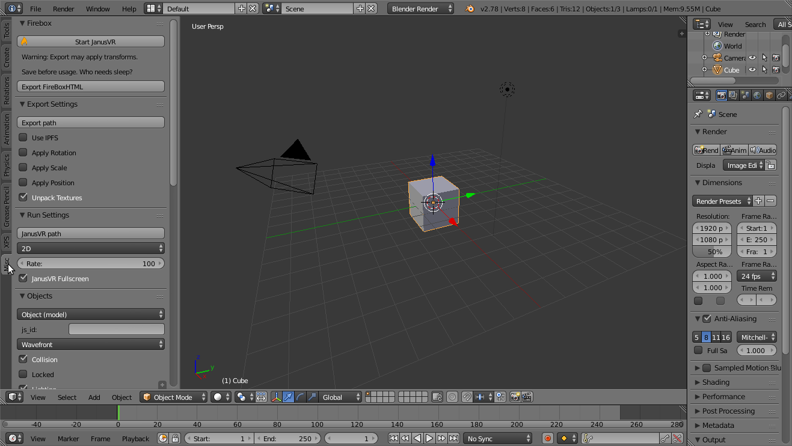

=============
Configuration
=============

You can find FireVR in the Misc Tab in the Toolbar (key: t).

Now, two last things are necessary:

1. Set the Export Path in the Export settings (this is where all files will be saved).
2. Set the JanusVR path in the Run settings (select the Janus executable)

To test if the settings are correct, click "Start JanusVR" - you should now see the default cube floating in space.
