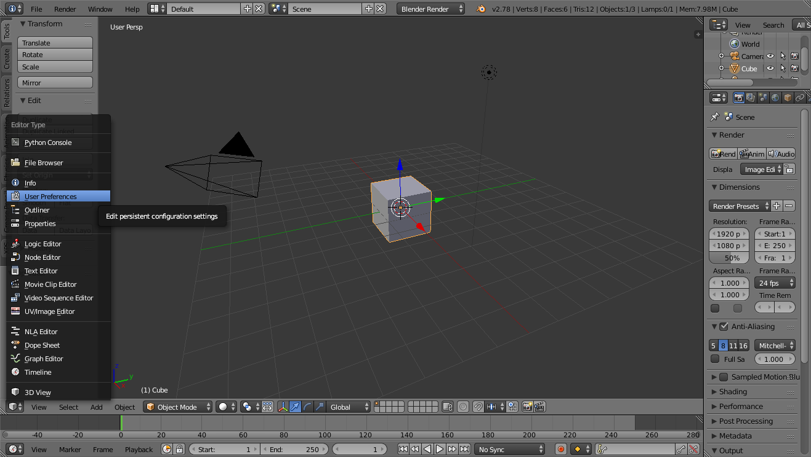
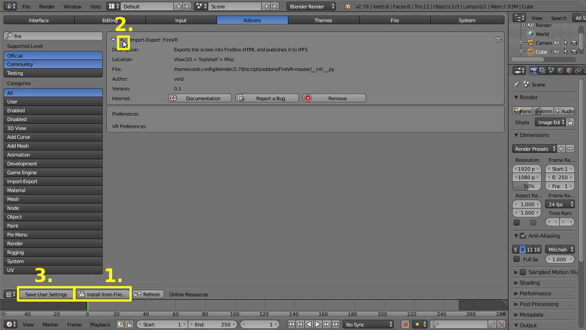

============
Installation
============

Use this link to download FireVR:

https://github.com/void4/FireVR/archive/master.zip

Or go to https://github.com/void4/FireVR and select the green "Clone or download" button at the top right, then "Download ZIP".

Make sure you have the latest Blender version (currently: 2.78a).
Next, start Blender and enter the User Preferences.

Then

1. Install from File
2. Activate the addon by marking the checkbox
3. Save User Settings to make the installation permanent

Done!
